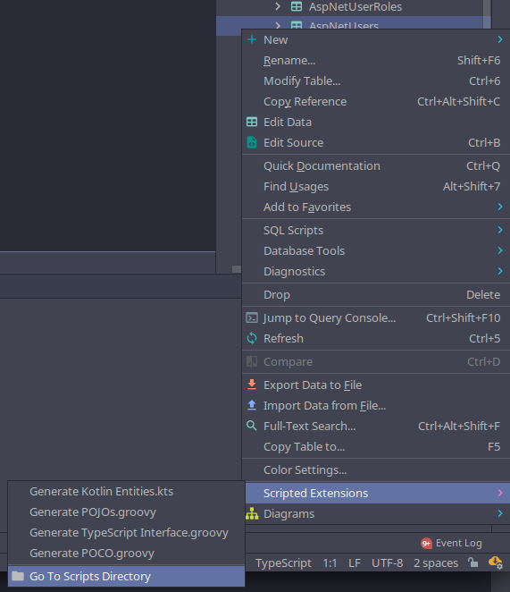

# JetBrains Product Extension Scripts

Scripts to extend JetBrains' products such as DataGrip, WebStorm, etc.

Inspired by [Yasikovsky's IntelliJ POCO Scripts](https://github.com/yasikovsky/intellij-poco-scripts)

## Scripts

**Note:** Examples generated using [this table definition](./samples/MenuItem.sql).

- [Generate POCO.groovy](./com.intellij.database/schema/Generate%20POCO.groovy): Generates a C# class with standard data annotations for the selected table ([example output](./samples/MenuItem.cs))
- [Generate TypeScript Interface.groovy](./com.intellij.database/schema/Generate%20TypeScript%20Interface.groovy): Generates a TypeScript interface for the selected table ([example output](./samples/IMenuItem.ts))

## Installation

The easiest way to find the folder to copy these files to is to right-click a table and find under the **scripted extensions** section of the context menu:

Or from the Project's **Scratches and Consoles** menu:

## LICENSE

This repository and the code inside of it is licensed under the MIT License. Read
[LICENSE](./LICENSE) for more information.